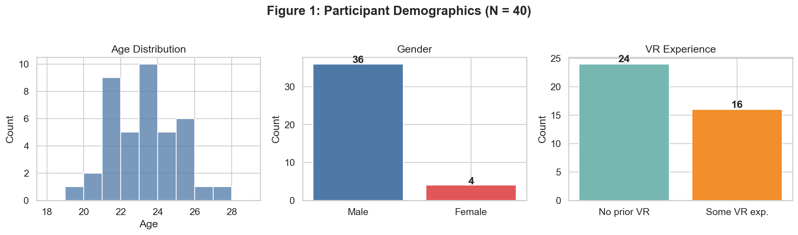
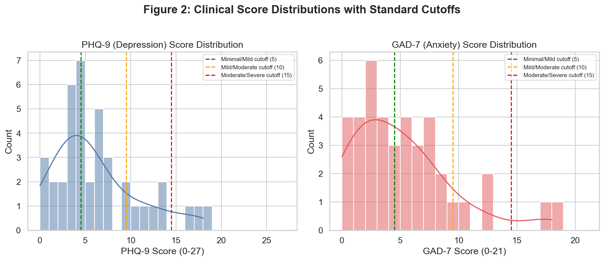
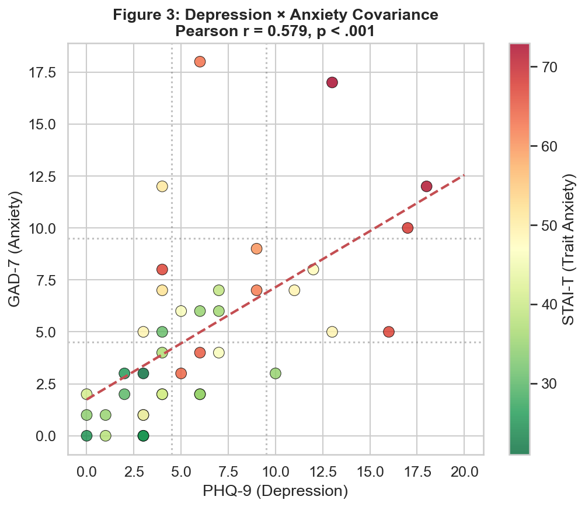
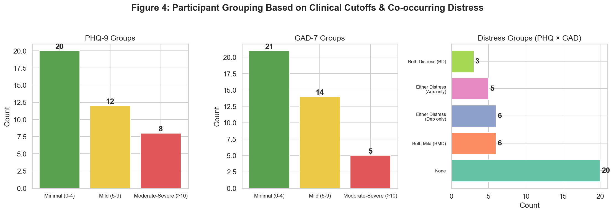
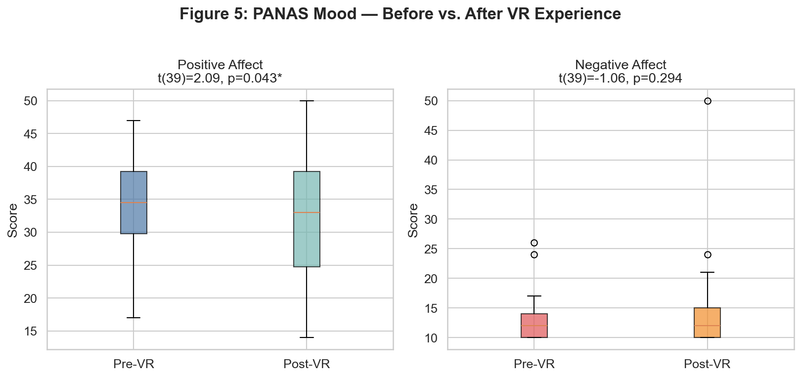
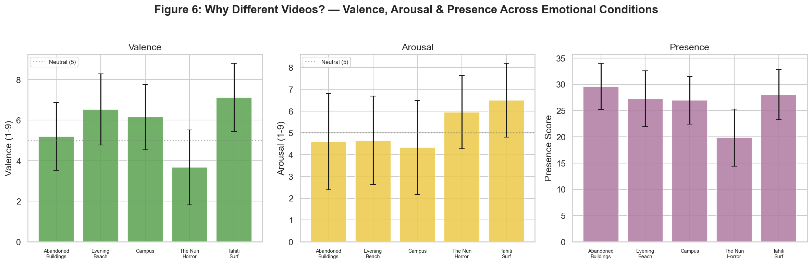
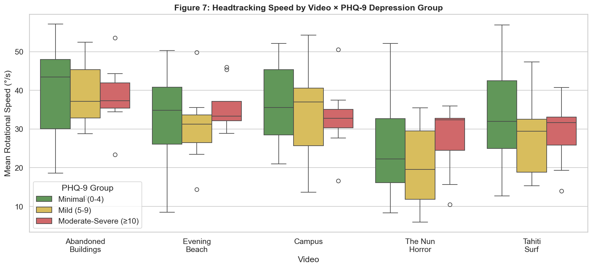
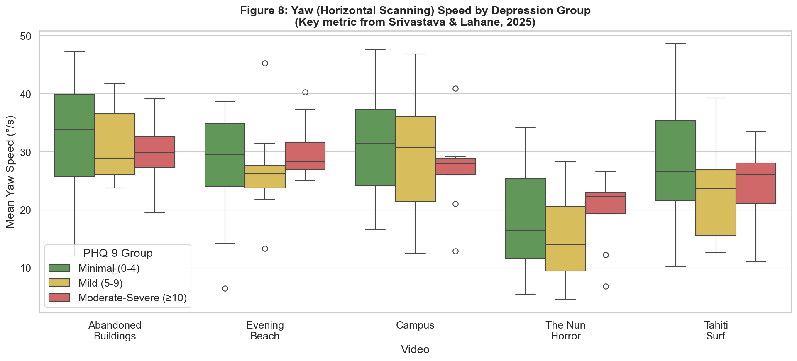
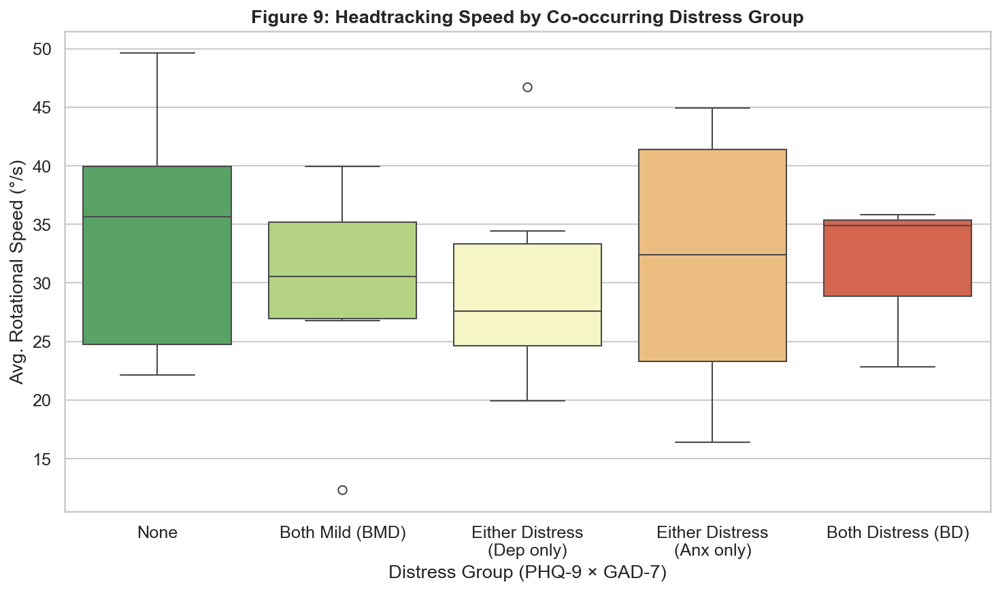
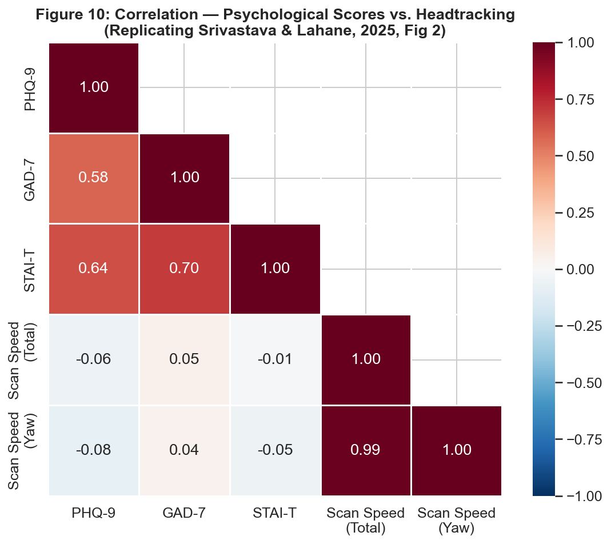

---
header-includes:
  - \usepackage{fancyhdr}
  - \pagestyle{plain}
markdown-pdf:
  headerTemplate: "

"
  footerTemplate: "

"
  displayHeaderFooter: false
---

# Report 1: Are Headtracking Measures an Indicator of Depressive Symptoms?

**360° Videos VR Experiment — Preliminary Analysis**

*Authors: Vishnu Sai Reddy(2023121009), Bharath Gajawada(2022101044), Pooja Rani(2024204019)*

Github link: https://github.com/bharath-gajawada/Data_Analysis_Services

---

## 1. Brief Introduction

This study investigates whether **head-movement patterns during 360° VR video exploration** can serve as objective indicators of depressive symptoms. Rather than relying solely on self-reported emotions and standardized questionnaires, we capture psychomotor behavior via headtracking — measuring how actively participants scan their virtual environment. The core idea: *depression may reduce exploratory head movement, providing an objective, behavioral marker*.

This is  based on the work of Srivastava & Lahane (2025), who found that individuals with moderate-to-severe depression exhibited significantly slower scanning speeds during 360° video viewing, even after controlling for anxiety.

>   Only self-reports alone miss important behavioral differences. So headtracking in VR may provide objective psychomotor markers for detecting depression.

---

## 2. Experiment Details

| Component | Detail |
|-----------|--------|
| **Participants** | N = 40 college students (36 male, 4 female), ages 19–27 (M = 22.78, SD = 1.80) |
| **VR Headset** | Meta Quest 3 |
| **Videos** | 5 × 360° videos spanning different emotional conditions |
| **Surveys** | PHQ-9, GAD-7, STAI-T, PANAS (pre & post VR), valence/arousal per video, Presence |
| **Headtracking** | Rotation data (Pitch/X, Yaw/Y, Roll/Z) + speed, recorded per video per participant |

>    Can see that we have significantly more male than female participants, college-aged sample with limited prior VR experience — which is consistent with the reference study's population.

---

## 3. Motivation for Study

Traditionally, depression screening methods employ **self questionnaires**, which are subjective, prone to recall bias, and cannot measure behavioral responses in real-time. VR provides a medium to create a virtual environment where psychomotor behaviors can be objectively measured. In the reference paper, **head movement scanning speed** while viewing 360-degree videos was significantly lower in people with moderate-to-severe depression, even though there were no differences in emotional ratings between groups.

In this study, the same method was employed on a new group of participants to investigate whether the same psychomotor behaviors are evident in a new group of people, whether headtracking can distinguish between different groups of people with different levels of depression, and whether people with both depression and anxiety show different behaviors than people with depression only.

> VR-based psychomotor assessment fills a gap in current methods, as objective behavioral responses are evident even when self-reporting fails to distinguish between depressed and non-depressed people.

---

## 4. Literature Review

**Depression and Psychomotor Retardation.** Clinical depression is associated with psychomotor disturbances, slowed physical movements and reactions (Choi et al., 2020). Since depression and anxiety frequently co-occur, studies examining behavioral markers must account for this comorbidity, as anxiety may independently influence psychomotor behavior.

**Assessment Instruments.** Depression severity is measured using the **PHQ-9** (Kroenke et al., 2001), anxiety using the **GAD-7** (Spitzer et al., 2006), and current mood using the **PANAS** (Watson et al., 1988). Emotional ratings (valence and arousal) follow Russell's (1980) Circumplex Model of Affect. VR presence is assessed using the Presence Questionnaire (Witmer & Singer, 1998).

**VR as an Assessment Tool.** Head-mounted VR provides controlled, immersive environments where 360° videos allow participants to freely explore, making head movement a natural proxy for psychomotor engagement.

**Key Reference — Srivastava & Lahane (2025).** In a study with N = 50 participants:
- Individuals with **moderate-to-severe depression showed significantly slower scanning speed** (M = 3.88 °/s, SD = 0.88) compared to mild (M = 4.94) and no depression (M = 5.29), with **large effect sizes** (d = −1.22 to −1.64).
- This effect held after controlling for anxiety via ANCOVA (p < .001, η² = .295).
- **Self-reported valence and arousal showed NO group differences** only the objective head movement data differentiated the groups.
- The **PHQ-9 × GAD-7 covariance** was strong (r = .752), motivating a "distress grouping" approach.
- Depression blunted responses to both positive and negative stimuli, with head movement uniformly reduced across all video types.

>    Srivastava & Lahane (2025) demonstrated that head scanning speed in VR is a valid psychomotor marker, and our study attempts to replicate these findings with a new sample.

---

## 5. Measures : What They Capture

### PHQ-9 (Patient Health Questionnaire-9)
A **9-item** self-report instrument measuring **depression severity** over the past 2 weeks. Each item is rated on a 0–3 scale ("Not at all" to "Nearly every day"), yielding a total score of **0–27**.

| Category | Score Range |
|----------|-------------|
| Minimal | 0–4 |
| Mild | 5–9 |
| Moderate | 10–14 |
| Moderately Severe | 15–19 |
| Severe | 20–27 |

### GAD-7 (Generalized Anxiety Disorder-7)
A **7-item** self-report measuring **anxiety severity** over the past 2 weeks, using the same 0–3 Likert scale. Total score range: **0–21**.

| Category | Score Range |
|----------|-------------|
| Minimal | 0–4 |
| Mild | 5–9 |
| Moderate | 10–14 |
| Severe | 15–21 |

### STAI-T (State-Trait Anxiety Inventory — Trait)
A **20-item** scale measuring **stable, long-term anxiety tendencies** (not current state). Score range: **20–80**. Higher scores = greater trait anxiety.

### PANAS (Positive and Negative Affect Schedule)
A **20-item** scale measuring **current mood** split into Positive Affect (PA, 10 items) and Negative Affect (NA, 10 items). Administered **before and after** VR exposure to detect mood changes. Score range per subscale: **10–50**.

### Headtracking Measures
- **Scanning speed**: Rate of angular head movement (°/s) — computed as total angular distance / time. Higher speed = more active exploration.
- **Yaw (Y-axis)**: Horizontal head turning — the primary scanning motion in 360° videos.
- **Pitch (X-axis)**: Vertical nodding. **Roll (Z-axis)**: Head tilting (minimal in VR viewing).
- **Standard deviation**: Variability of head position around the mean — captures exploration range.

>    PHQ-9 and GAD-7 use established clinical cutoffs for grouping; headtracking speed (especially yaw) is the primary behavioral outcome variable.

---

## 6. Depression & Anxiety Score Distributions

**Our sample distribution:**

| Group | PHQ-9 (Depression) | GAD-7 (Anxiety) |
|-------|-------------------|-----------------|
| Minimal (0-4) | 20 (50%) | 21 (52.5%) |
| Mild (5-9) | 12 (30%) | 14 (35%) |
| Moderate-Severe (≥10) | 8 (20%) | 5 (12.5%) |

Compared to the reference paper (40% moderate-severe), our sample has only **20% moderate-severe depression**, reducing group sizes and statistical power.

>    Our sample is skewed toward minimal/mild depression — the moderate-severe group (n=8) is small, limiting power to detect effects.

---

## 7. Hypothesis, Statistical Tests & Depression–Anxiety Covariance

### Hypotheses
**H1**: Individuals with higher PHQ-9 scores will exhibit lower headtracking scanning speeds during 360° video exploration.
**H2**: This effect will be most pronounced for yaw (horizontal scanning) speed, consistent with Srivastava & Lahane (2025).

### Depression × Anxiety Covariance
Depression and anxiety are highly comorbid. In our sample:

- **PHQ-9 × GAD-7**: r = .579, p < .001
- **PHQ-9 × STAI-T**: r = .642, p < .001

Following the reference paper's approach, we created **distress groups** based on PHQ-9 × GAD-7 covariance:

| Distress Group | Definition | N |
|----------------|-----------|---|
| None | Both PHQ-9 and GAD-7 < 5 | 20 |
| Both Mild (BMD) | Both scores 5–9 | 6 |
| Either Distress (Dep only) | PHQ ≥ 5, GAD < 5 | 6 |
| Either Distress (Anx only) | GAD ≥ 5, PHQ < 5 | 5 |
| Both Distress (BD) | Both ≥ 10 | 3 |

### Statistical Tests Used and why we used it

- **Welch's t-tests** (Minimal vs. Moderate-Severe group comparisons): Chosen over the standard Student's t-test because our depression groups have unequal sample sizes (n=20 vs. n=8) and potentially unequal variances. Welch's t-test does not assume equal variances, making it more robust for our unbalanced design.

- **Kruskal-Wallis test** (across 3 PHQ groups): Used as a non-parametric alternative to one-way ANOVA, following the reference paper's methodology. With small and unequal group sizes, normality assumptions required by ANOVA may not hold. Kruskal-Wallis ranks the data and is robust to non-normal distributions and outliers.

- **Pearson correlations** (PHQ-9/GAD-7/STAI-T vs. headtracking speed): Used to assess linear relationships between continuous clinical scores and scanning speed. This treats depression and anxiety as continuous variables rather than categorical groups, preserving statistical power with our limited sample size.

- **Paired t-tests** (PANAS pre vs. post VR): Appropriate because the same participants are measured at two time points (before and after VR exposure). The paired design controls for individual differences, isolating the effect of VR exposure on mood.

- **Cohen's d** (effect sizes for all comparisons): Reported alongside p-values because with small samples, effect sizes provide information about the magnitude of differences regardless of statistical significance. This allows meaningful comparison with the reference paper's large effects (d = −1.22 to −1.64).

> Depression and anxiety are strongly correlated (r=.58), necessitating covariance-based grouping; Both Distress group has only n=3, limiting distress analysis.

---

## 8. Pre- and Post-VR Mood (PANAS)

| Affect | Pre-VR M (SD) | Post-VR M (SD) | t(39) | p |
|--------|---------------|-----------------|-------|---|
| Positive | 34.52 (7.33) | 32.15 (10.30) | 2.09 | **.043*** |
| Negative | 12.70 (3.52) | 13.95 (6.80) | −1.06 | .294 |

**Positive affect significantly decreased** after VR exposure, while negative affect did not significantly change. The decrease in positive mood may reflect the emotionally heavy content of certain videos (e.g., The Nun Horror).

>    VR exposure reduced positive mood significantly — the experience was not neutral, which is important context for interpreting headtracking results.

---

## 9. Why Different Videos? — Valence, Arousal & Presence

The 5 videos were selected to span **different emotional conditions**, ensuring headtracking behavior is measured across diverse stimuli:

| Video | Expected Emotion | Valence M | Arousal M |
|-------|-----------------|-----------|-----------|
| V1: Abandoned Buildings | Eerie/Unsettling | 5.20 | 4.60 |
| V2: Evening at Beach | Pleasant/Calm | 6.53 | 4.65 |
| V3: Campus | Familiar/Neutral | 6.15 | 4.33 |
| V4: The Nun Horror | Fearful/Intense | 3.67 | 5.95 |
| V5: Tahiti Surf | Pleasant/Exciting | 7.12 | 6.50 |

**Key observations:**
- Videos successfully span different emotional conditions — from unpleasant/intense (Horror) to pleasant/exciting (Surf)
- **V4 (Horror) had notably lower presence scores** (M = 19.85 vs. ~27–30 for others), suggesting fear may break immersion
- Using multiple video types tests whether depression effects are **consistent across stimuli** or **stimulus-specific**

>    The 5 videos span different emotional regions, enabling us to test whether depression reduces scanning across ALL stimuli (supporting emotional context insensitivity).

---

## 10. Visualizations & Results

### 10.1 Headtracking Speed by Depression Group (Clinical Cutoffs)

**Table: Welch's t-tests — Minimal vs. Moderate-Severe Depression**

| Video | Mod-Severe M (SD) | Minimal M (SD) | t | p | Cohen's d |
|-------|-------------------|-----------------|---|---|-----------|
|  Abandoned Buildings | 38.39 (8.65) | 40.34 (11.80) | −0.48 | .635 | −0.19 |
|  Evening at the Beach | 35.55 (6.50) | 32.88 (10.34) | 0.82 | .422 | 0.31 |
|  Campus | 32.89 (9.47) | 36.56 (10.25) | −0.90 | .382 | −0.37 |
|  The Nun Horror | 27.49 (9.32) | 25.14 (12.04) | 0.55 | .589 | 0.22 |
|   Tahiti Surf| 29.09 (8.62) | 33.78 (12.52) | −1.13 | .271 | −0.44 |

All p-values are non-significant. The **Tahiti Surf** and **Campus** videos show the largest (still non-significant) effects in the expected direction (d = −0.44, −0.37).

### 10.2 Yaw (Horizontal Scanning) Speed — Key Metric

Yaw speed — the primary metric in Srivastava & Lahane (2025) — similarly shows **non-significant** differences (all p > .24). 

**Kruskal-Wallis** (non-parametric, replicating paper): Total Speed H = 0.90, p = .639; Yaw Speed H = 1.11, p = .573.

### 10.3 Headtracking by Distress Group (Covariance-Based)

The distress grouping shows some visual trends — "Both Distress" participants tend toward lower speeds — but group sizes are too small (BD: n = 3) for meaningful inference.

### 10.4 Correlation Matrix

| Pair | r | p |
|------|---|---|
| PHQ-9 × GAD-7 | .579 | < .001 |
| PHQ-9 × STAI-T | .642 | < .001 |
| PHQ-9 × Scan Speed | −.060 | .712 |
| PHQ-9 × Yaw Speed | −.081 | .617 |
| GAD-7 × Scan Speed | .048 | .768 |

Correlations between psychological scores and headtracking speed are **weak and non-significant**, contrasting with the reference paper's moderate negative correlations.

>    No statistically significant headtracking differences between depression groups — likely due to our smaller sample (N=40, only 8 moderate-severe) compared to the reference paper (N=50, 20 moderate-severe).

---

## 11. Conclusions

1. **Direction partially consistent**: The moderate-severe depression group showed slightly lower scanning speeds for Campus and Tahiti Surf videos, matching the reference paper's direction, but effects were non-significant.
2. **Self-reported emotions worked as expected**: Videos successfully elicited the intended emotional responses (validated via valence/arousal ratings), and VR exposure significantly decreased positive affect.
3. **Replication not achieved**: Unlike Srivastava & Lahane (2025) who found significant scanning speed differences (p < .001, d = −1.22 to −1.64), our results show no significant group differences.
4. **Primary limitation — Small sample size**: With only **n = 8** in the moderate-severe group (vs. n = 20 in the reference paper), we lack statistical power. Additionally, our sample has only 20% moderate-severe depression compared to 40% in the reference study.
5. **Depression–anxiety covariance**: The strong PHQ-9 × GAD-7 correlation (r = .579) means isolating depression's unique effect requires controlling for anxiety — but our small n prevents reliable ANCOVA.

>    The study is underpowered to detect the moderate effects found in the reference paper; larger/more clinically diverse samples are needed to replicate the finding.

---

## 12. Plan for Report 2

1. **ANCOVA**: Control for GAD-7 and STAI-T as covariates when testing depression's effect on scanning speed (replicating the reference paper's primary analysis).
2. **Regression/GLM**: Use PHQ-9 as a continuous predictor (avoid dichotomization) to maximize statistical power with our small sample.
3. **Mixed-effects models**: Model video type as a within-subjects factor to test whether depression × video-type interaction exists.
4. **Advanced headtracking features**: Analyze standard deviation of yaw (SDY) — used in the reference paper — and temporal dynamics (speed trajectory over video duration).
5. **Power analysis**: Formally compute the sample size needed to detect the reference paper's effect sizes (d ≈ 1.2–1.6) and discuss implications for the current study.
6. **Normality checks**: Apply Shapiro-Wilk tests (as in reference paper) to determine appropriate parametric vs. non-parametric tests for each variable.

>    Report 2 will use ANCOVA and continuous regression to maximize power, replicate the reference paper's methods more closely, and analyze temporal headtracking patterns.

---

## Contributions

All members Have contributed equally

| Member | Contributions |
|--------|--------------|
| **Bharath Gajawada** | Data preprocessing, demographic analysis, clinical score distributions (PHQ-9, GAD-7), depression–anxiety covariance analysis and distress group creation |
| **Vishnu Sai Reddy** | Headtracking data analysis (scanning speed, yaw speed by depression groups), Welch's t-tests, Kruskal-Wallis tests, correlation analysis, generating all statistical figures |
| **Pooja Rani** | Literature review, PANAS pre/post analysis, valence/arousal/presence analysis across videos, report writing and formatting, interpretation of results

All members contributed equally to study planning, participant recruitment, and reviewing the final report.

---

## References

- Choi, K. W., Kim, Y.-K., & Jeon, H. J. (2020). The critical relationship between anxiety and depression. *The American Journal of Psychiatry*, 177(11), 1042–1049.
- Kroenke, K., Spitzer, R. L., & Williams, J. B. (2001). The PHQ-9: Validity of a brief depression severity measure. *Journal of General Internal Medicine*, 16(9), 606–613.
- Russell, J. A. (1980). A circumplex model of affect. *Journal of Personality and Social Psychology*, 39(6), 1161–1178.
- Spitzer, R. L., Kroenke, K., Williams, J. B. W., & Löwe, B. (2006). A brief measure for assessing generalized anxiety disorder: The GAD-7. *Archives of Internal Medicine*, 166(10), 1092–1097.
- Srivastava, P. & Lahane, R. (2025). What do head scans reveal about depression? Insights from 360° psychomotor assessment. *Proceedings of the 47th Annual Conference of the Cognitive Science Society*.
- Watson, D., Clark, L. A., & Tellegen, A. (1988). Development and validation of brief measures of positive and negative affect: The PANAS scales. *Journal of Personality and Social Psychology*, 54(6), 1063–1070.
- Witmer, B. G. & Singer, M. J. (1998). Measuring presence in virtual environments: A presence questionnaire. *Presence: Teleoperators and Virtual Environments*, 7(3), 225–240.
